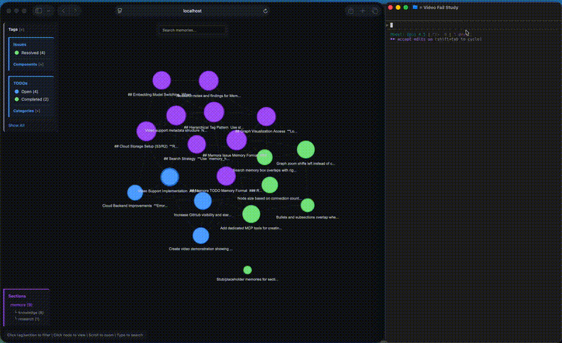

# Memora
<br clear="left">

A lightweight Model Context Protocol (MCP) server that persists shared memories in SQLite. Compatible with Claude Code, Codex CLI, and other MCP-aware clients.



## Features

- **Persistent Storage** - SQLite-backed database with optional cloud sync (S3, GCS, Azure)
- **Semantic Search** - Vector embeddings (TF-IDF, sentence-transformers, or OpenAI)
- **Event Notifications** - Poll-based system for inter-agent communication
- **Advanced Queries** - Full-text search, date ranges, tag filters (AND/OR/NOT)
- **Cross-references** - Auto-linked related memories based on similarity
- **Hierarchical Organization** - Explore memories by section/subsection
- **Export/Import** - Backup and restore with merge strategies
- **Knowledge Graph** - Interactive HTML visualization with filtering
- **Live Graph Server** - Auto-starts HTTP server for remote access via SSH
- **Statistics & Analytics** - Tag usage, trends, and connection insights
- **Zero Dependencies** - Works out-of-box with Python stdlib (optional backends available)

## Install

```bash
# From GitHub
pip install git+https://github.com/agentic-mcp-tools/memora.git

# With extras
pip install -e ".[cloud]"       # S3/R2/GCS cloud storage (boto3)
pip install -e ".[embeddings]"  # semantic search (sentence-transformers)
pip install -e ".[all]"         # cloud + embeddings + dev tools
```

## Usage

The server runs automatically when configured in Claude Code. Manual invocation:

```bash
# Default (stdio mode for MCP)
memora-server

# With graph visualization server
memora-server --graph-port 8765

# HTTP transport (alternative to stdio)
memora-server --transport streamable-http --host 127.0.0.1 --port 8080
```

## Claude Code Config

Add to `.mcp.json` in your project root:

### Local DB
```json
{
  "mcpServers": {
    "memory": {
      "command": "memora-server",
      "args": [],
      "env": {
        "MEMORA_DB_PATH": "~/.local/share/memora/memories.db",
        "MEMORA_ALLOW_ANY_TAG": "1",
        "MEMORA_GRAPH_PORT": "8765"
      }
    }
  }
}
```

### Cloud DB (S3/R2)
```json
{
  "mcpServers": {
    "memory": {
      "command": "memora-server",
      "args": [],
      "env": {
        "AWS_PROFILE": "memora",
        "AWS_ENDPOINT_URL": "https://<account-id>.r2.cloudflarestorage.com",
        "MEMORA_STORAGE_URI": "s3://memories/memories.db",
        "MEMORA_CLOUD_ENCRYPT": "true",
        "MEMORA_ALLOW_ANY_TAG": "1",
        "MEMORA_GRAPH_PORT": "8765"
      }
    }
  }
}
```

## Codex CLI Config

Add to `~/.codex/config.toml`:

```toml
[mcp_servers.memory]
  command = "memora-server"  # or full path: /path/to/bin/memora-server
  args = ["--no-graph"]
  env = {
    AWS_PROFILE = "memora",
    AWS_ENDPOINT_URL = "https://<account-id>.r2.cloudflarestorage.com",
    MEMORA_STORAGE_URI = "s3://memories/memories.db",
    MEMORA_CLOUD_ENCRYPT = "true",
    MEMORA_ALLOW_ANY_TAG = "1",
  }
```

## Environment Variables

| Variable               | Description                                                                 |
|------------------------|-----------------------------------------------------------------------------|
| `MEMORA_DB_PATH`       | Local SQLite database path (default: `~/.local/share/memora/memories.db`)  |
| `MEMORA_STORAGE_URI`   | Cloud storage URI for S3/R2 (e.g., `s3://bucket/memories.db`)              |
| `MEMORA_CLOUD_ENCRYPT` | Encrypt database before uploading to cloud (`true`/`false`)                |
| `MEMORA_CLOUD_COMPRESS`| Compress database before uploading to cloud (`true`/`false`)               |
| `MEMORA_CACHE_DIR`     | Local cache directory for cloud-synced database                            |
| `MEMORA_ALLOW_ANY_TAG` | Allow any tag without validation against allowlist (`1` to enable)         |
| `MEMORA_TAG_FILE`      | Path to file containing allowed tags (one per line)                        |
| `MEMORA_TAGS`          | Comma-separated list of allowed tags                                       |
| `MEMORA_GRAPH_PORT`    | Port for the knowledge graph visualization server (default: `8765`)        |
| `MEMORA_EMBEDDING_MODEL` | Embedding backend: `tfidf` (default), `sentence-transformers`, or `openai` |
| `SENTENCE_TRANSFORMERS_MODEL` | Model for sentence-transformers (default: `all-MiniLM-L6-v2`)        |
| `OPENAI_API_KEY`       | API key for OpenAI embeddings (required when using `openai` backend)       |
| `OPENAI_EMBEDDING_MODEL` | OpenAI embedding model (default: `text-embedding-3-small`)                |
| `AWS_PROFILE`          | AWS credentials profile from `~/.aws/credentials` (useful for R2)          |
| `AWS_ENDPOINT_URL`     | S3-compatible endpoint for R2/MinIO                                        |
| `R2_PUBLIC_DOMAIN`     | Public domain for R2 image URLs                                            |

## Semantic Search & Embeddings

Memora supports three embedding backends for semantic search:

| Backend | Install | Quality | Speed |
|---------|---------|---------|-------|
| `tfidf` (default) | None | Basic keyword matching | Fast |
| `sentence-transformers` | `pip install sentence-transformers` | True semantic understanding | Medium |
| `openai` | `pip install openai` | High quality | API latency |

**Automatic:** Embeddings and cross-references are computed automatically when you `memory_create`, `memory_update`, or `memory_create_batch`.

**Manual rebuild required** when:
- Changing `MEMORA_EMBEDDING_MODEL` after memories exist
- Switching to a different sentence-transformers model

```bash
# After changing embedding model, rebuild all embeddings
memory_rebuild_embeddings

# Then rebuild cross-references to update the knowledge graph
memory_rebuild_crossrefs
```

## Neovim Integration

Browse memories directly in Neovim with Telescope. Copy the plugin to your config:

```bash
# For kickstart.nvim / lazy.nvim
cp nvim/memora.lua ~/.config/nvim/lua/kickstart/plugins/
```

**Usage:** Press `<leader>sm` to open the memory browser with fuzzy search and preview.

Requires: `telescope.nvim`, `plenary.nvim`, and `memora` installed in your Python environment.

## Knowledge Graph Export

Export memories as an interactive HTML knowledge graph visualization:

```python
# Via MCP tool
memory_export_graph(output_path="~/memories_graph.html", min_score=0.25)
```

Interactive vis.js graph with tag/section filtering, memory tooltips, Mermaid diagram rendering, and auto-resized image thumbnails. Click nodes to view content, drag to explore.

## Graph Color Scheme

| Type | Color | Meaning |
|------|-------|---------|
| **Tags** | Purple shades | Different tags get different purple tones |
| **Issues** | Red | Open |
| | Orange | In Progress |
| | Green | Resolved |
| | Gray | Won't Fix |
| **TODOs** | Blue | Open |
| | Orange | In Progress |
| | Green | Completed |
| | Red | Blocked |

Node size reflects connection count (more connections = larger node).

## Live Graph Server

A built-in HTTP server starts automatically with the MCP server, serving the graph visualization on-demand.

**Access locally:**
```
http://localhost:8765/graph
```

**Remote access via SSH:**
```bash
ssh -L 8765:localhost:8765 user@remote
# Then open http://localhost:8765/graph in your browser
```

**Configuration:**
```json
{
  "env": {
    "MEMORA_GRAPH_PORT": "8765"
  }
}
```

Use different ports on different machines to avoid conflicts when forwarding multiple servers.

To disable: add `"--no-graph"` to args in your MCP config.
